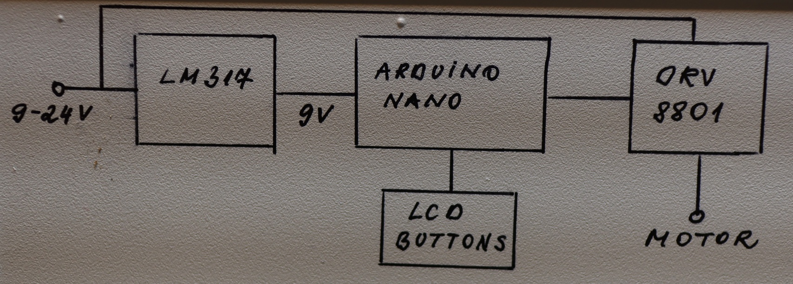
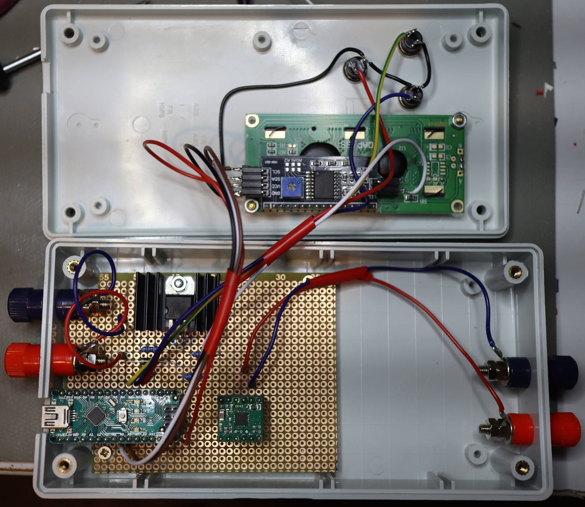
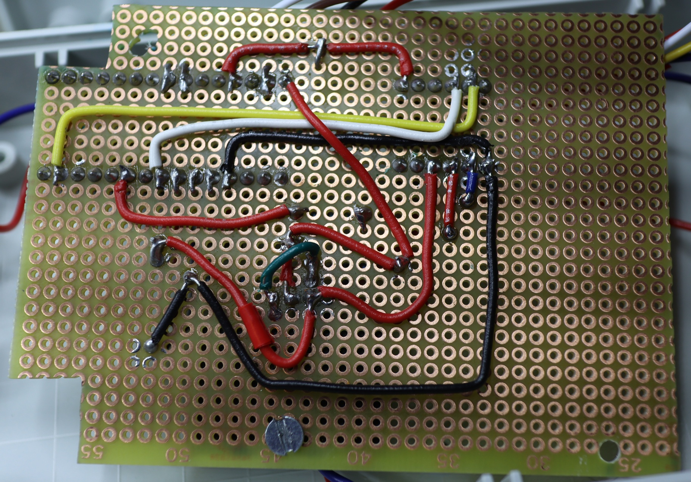
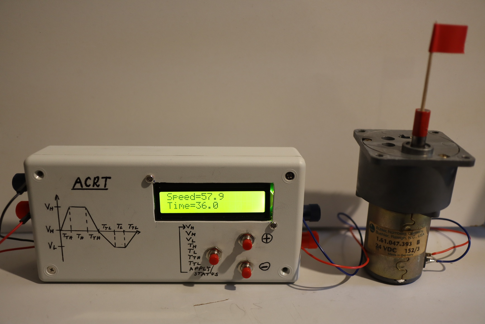

# ACRT
Periodic change of rotation direction with a DC motor

## Description

ACRT (Accelerated crucible rotation) is a technique initially used for the rotation of crucibles during crystal growth [1].

Motor rotation rate is increased and decreased in a periodic way, optionally changing also the direction.

>[1] H. J. Scheel, E. O. Schulz-Dubois, Flux growth of large crystals by accelerated crucible-rotation technique. Journal of Crystal Growth 8 (1971) 304-306.

## Schematics

- Max. motor current = 0.5 A
- Supply voltage = 9...24 V

.

## Layout

.
.

## Motor box

.

## Acknowledgements

[This project](https://nemocrys.github.io/) has received funding from the European Research Council (ERC) under the European Union's Horizon 2020 research and innovation programme (grant agreement No 851768).

